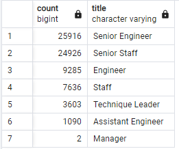

# Pewlett-Hackard-Analysis
## Overview of the analysis: 
Explain the purpose of this analysis.
## Results: 
Provide a bulleted list with four major points from the two analysis deliverables. Use images as support where needed.
- When querying retirement ready employees, from the employees table, it was found that there were many duplicate employees due to changing titles over time. The employee table returned 133,776 employees with birthdates between 1952 and 1955.
- When we queried for unique employees ready for retirement, there were 72,458 employees returned.
- A query of unique titles count of retiring employees showed that Senior Engineer and Senior Staff positions had the most employees that are ready for retirement.

- The mentor eligibility query returned 1,549 rows. These were employees born in 1965.
## Summary: 
Provide high-level responses to the following questions, then provide two additional queries or tables that may provide more insight into the upcoming "silver tsunami."
- How many roles will need to be filled as the "silver tsunami" begins to make an impact?
  - There are 72,458 roles to be filled in total.
- Are there enough qualified, retirement-ready employees in the departments to mentor the next generation of Pewlett Hackard employees?
  - 
